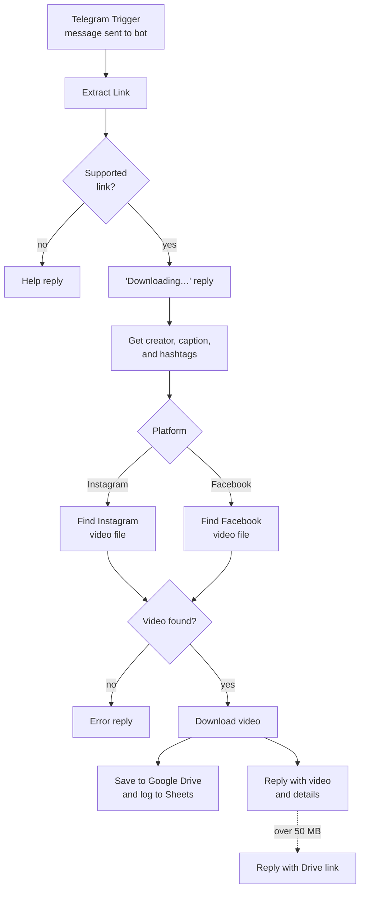

# n8n Instagram Video Downloader and Facebook Video Download Telegram Bot with Google Drive Content Library

**Workflow file:** [`Download Instagram & Facebook Videos_Reels with Telegram Bot.json`](../Download%20Instagram%20%26%20Facebook%20Videos_Reels%20with%20Telegram%20Bot.json)

This n8n workflow turns a Telegram bot into an Instagram Reel and Facebook video downloader. Send the bot a link and it replies with the video, the creator's handle, the caption, and the hashtags. Each video is also saved to Google Drive and logged to a Google Sheets content library, so your team builds a searchable archive of saved content.

---

## What it's used for

- **Saving reference content.** Social media managers and creators can save Reels and videos they want to study or reference, straight from their phone's share menu.
- **Building a swipe file.** Every download is logged with its creator, caption, hashtags, source link, and Drive file, so good ideas are easy to find later.
- **Crediting creators.** The creator's handle and original caption come back with each video, so reposts and references can be attributed correctly.
- **Archiving your own posts.** Keep copies of your brand's Instagram and Facebook videos in Google Drive.
- **Sharing with a team.** Anyone in a group chat with the bot can drop in a link, and the video lands in a shared Drive folder.

## At a glance

| | |
|---|---|
| **Trigger** | A message sent to your Telegram bot |
| **Supported links** | Instagram (`instagram.com`, `instagr.am`) and Facebook (`facebook.com`, `fb.watch`, `fb.com`) |
| **Replies with** | The video, creator, caption, hashtags, and Drive link |
| **Storage** | Google Drive (video files) and Google Sheets (content library log) |
| **Video source** | Third-party downloader services (snapdownloader.com for Instagram, fbdownloader.to for Facebook) |
| **Error handling** | Help reply for messages without a link, error reply for failed downloads, and a Drive link for videos over Telegram's 50 MB limit |
| **AI** | None |
| **Credentials** | Telegram, Google Drive, Google Sheets |

---

## How it works

The canvas is organized into five labeled sections.

### Step 1: Receive the link

| Node | What it does |
|---|---|
| `Telegram Trigger` | Receives every message sent to the bot. |
| `Extract Link` | Finds the first Instagram or Facebook link in the message text or media caption. It removes punctuation that often follows a pasted link, converts `fb.com` links to `facebook.com`, and records the chat, message, and sender. |
| `Is Supported Link?` | Sends messages with a supported link on to download. Everything else, including `/start`, stickers, and photos without a link, gets the help reply. |

### Step 2: Reply and get post details

| Node | What it does |
|---|---|
| `Send Help Message` | Replies: "Send me a link to a public Instagram Reel or Facebook video and I'll send the video back 🎬" |
| `Send Downloading Message` | Replies right away with "⏬ Downloading your Instagram video… please wait ⌛" (or Facebook). |
| `Get Post Details` | Requests the post page the way a link previewer does, to read the preview title and description Instagram and Facebook provide when a link is shared. If the request fails, the workflow continues. |
| `Extract Post Details` | Pulls out the creator's handle, the caption, and the hashtags. Fields stay empty when a post doesn't expose them. |

Instagram previews usually include the creator, caption, and hashtags. Facebook previews usually include the caption and hashtags but not the creator.

### Step 3: Find the video file

| Node | What it does |
|---|---|
| `Route by Platform` | Sends the link to the Instagram or Facebook branch. |
| `Fetch Instagram Video Page` | Asks snapdownloader.com's Instagram downloader for the Reel. |
| `Find Instagram Video URL` | Takes the first `.mp4` link from the response. |
| `Fetch Facebook Video` | Sends the link to fbdownloader.to. |
| `Find Facebook Download URL` | Takes the first download link from the response. |
| `Has Video URL?` | Continues if a video link was found. Otherwise the bot sends the error reply. |

If either fetch request fails, the bot sends the error reply instead of stopping silently.

### Step 4: Download, save, and send

| Node | What it does |
|---|---|
| `Download Video` | Downloads the video file, waiting up to 2 minutes. If the download fails, the bot sends the error reply. |
| `Upload to Google Drive` | Saves the video with a name like `instagram_jane.doe_20260914-181502.mp4`. |
| `Build Library Entry` | Prepares the content library row. |
| `Log to Content Library` | Appends the row to your Google Sheet. Columns are created automatically. |
| `Send Video` | Replies to the original message with the video. The caption shows the creator, the caption (shortened to 700 characters to fit Telegram's limit), and the Drive link. |
| `Send Video Link` | If Telegram rejects the upload, usually because the file is over 50 MB, replies with the Drive link instead. |
| `Send Error Message` | Replies: "Sorry, I couldn't download that video 😕 Make sure the post is public and the link is correct, then try again." |

The Drive upload and Sheets log run before the video reply, so the Drive link can be included. If either fails, the video is still sent.

Each row in the content library contains:

| Column | Meaning |
|---|---|
| `saved_at` | When the video was saved |
| `platform` | `instagram` or `facebook` |
| `source_url` | The link that was sent to the bot |
| `creator` | The creator's handle, when available |
| `caption` | The full original caption, when available |
| `hashtags` | Hashtags from the caption, separated by spaces |
| `drive_file` | The file name in Google Drive |
| `drive_link` | A link to the file in Google Drive |
| `requested_by` | The Telegram username (or name) of the person who sent the link |

---

## Setup

### 1. Create a Telegram bot

1. Open Telegram and message **@BotFather**.
2. Send `/newbot` and follow the prompts to name your bot.
3. Copy the bot token BotFather gives you.

### 2. Import the workflow and connect credentials

In n8n, go to **Workflows → Import from File** and select the workflow file. Then connect:

| Service | Nodes |
|---|---|
| Telegram (your bot token) | `Telegram Trigger`, `Send Downloading Message`, `Send Help Message`, `Send Video`, `Send Video Link`, `Send Error Message` |
| Google Drive | `Upload to Google Drive` |
| Google Sheets | `Log to Content Library` |

### 3. Choose where videos and logs are saved

| Node | Set |
|---|---|
| `Upload to Google Drive` | The Drive and folder for downloaded videos. It uploads to the root of My Drive until you change it. |
| `Log to Content Library` | The spreadsheet and sheet for the content library. An empty sheet is fine. |

Drive links only open for people with access to the file. Share the download folder with your team so the links in Telegram work for everyone.

### 4. Activate and test

Activate the workflow, then send your bot:

1. A public Instagram Reel link
2. A public Facebook video link
3. A message without a link, to check the help reply

For group chats, add the bot to the group. Depending on the bot's privacy settings in BotFather, it may only see messages that mention it or reply to it.

### 5. Download services

The video files come from third-party downloader sites, not from Instagram's or Facebook's own APIs:

| Platform | Service | Nodes |
|---|---|---|
| Instagram | snapdownloader.com | `Fetch Instagram Video Page`, `Find Instagram Video URL` |
| Facebook | fbdownloader.to | `Fetch Facebook Video`, `Find Facebook Download URL` |

These sites can change or go offline without notice. When this guide was written, snapdownloader.com's Instagram tool was returning "not found" errors. If a platform stops working, replace its **Fetch** and **Find** nodes with another source. [yt-dlp](https://github.com/yt-dlp/yt-dlp) on a self-hosted n8n instance, or a paid scraping API, are more dependable options. Anything that returns a direct video file link works with the rest of the workflow.

### 6. Make it yours

- **Limit who can use the bot:** in `Telegram Trigger`, add **Restrict to User IDs** or **Restrict to Chat IDs** so only your team can use it.
- **Change the bot's replies:** edit the text in the `Send …` nodes.
- **Organize files:** change the folder or the file name expression in `Upload to Google Drive`, for example to add the requester's name.
- **Log more details:** add fields to `Build Library Entry`. New columns appear in the sheet automatically.
- **Show a longer caption in Telegram:** raise `MAX_CAPTION` in `Extract Post Details`, keeping the total under Telegram's 1,024-character caption limit.

---

## Troubleshooting

| Symptom | Likely cause |
|---|---|
| The bot doesn't respond at all | The workflow isn't active, or the Telegram credential on `Telegram Trigger` uses a different bot token |
| Every link gets the help reply | The link isn't from a supported domain, or the message is a forwarded post without a link |
| Instagram links always get the error reply | snapdownloader.com's Instagram tool isn't returning a video. Replace `Fetch Instagram Video Page` and `Find Instagram Video URL`. |
| Facebook links always get the error reply | fbdownloader.to changed or blocked the request. Check `Fetch Facebook Video`'s output. |
| Some links get the error reply | The post is private, age-restricted, or deleted, or it's a photo post with no video |
| The video arrives without a creator or caption | The post's preview didn't include them. This is common for Facebook creators and private or restricted posts. |
| The reply has no Drive link | `Upload to Google Drive` failed. Check its credential and folder. |
| Nothing appears in the content library | `Log to Content Library` failed. Check its credential and selected sheet. |
| Drive links say "You need access" | The download folder isn't shared with the person opening the link |
| Long videos come back as a link instead of a video | The file is over Telegram's 50 MB limit for bots. The Drive link has the full video. |
