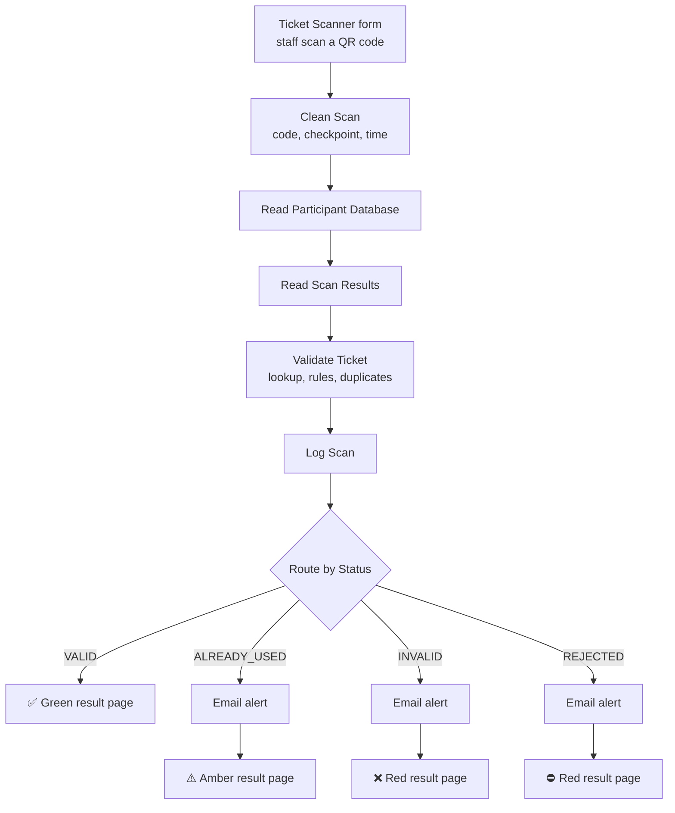

# QR Ticket Scanner and Validator

**Workflow file:** [`Validate QR tickets in real time with n8n Forms and Google Sheets.json`](../Validate%20QR%20tickets%20in%20real%20time%20with%20n8n%20Forms%20and%20Google%20Sheets.json)

This n8n workflow turns any Android phone into an event check-in scanner. Door staff scan a ticket's QR code into an n8n form and immediately see a full-screen result: valid, already used, invalid, or not allowed. Every scan is checked against your participant database in Google Sheets, logged to a Scan Results sheet, and suspicious scans trigger an email alert.

It's designed as the companion to the **Automated e-Ticket PDF Generator**, which creates the tickets this workflow checks.

---

## What it's used for

- **Event check-in without ticketing hardware.** Staff use their own phones and a free scanner app instead of dedicated scanners.
- **Stopping ticket sharing.** A ticket that's already been admitted, including a screenshot of it, shows **ALREADY USED** on the next scan.
- **Enforcing ticket rules at the door.** Cancelled or refunded tickets, tickets for a different day, and tickets for the wrong area are turned away automatically.
- **Controlling access to separate areas.** Run different checkpoints, such as a main entrance and a VIP area, each with its own access rules.
- **Keeping security informed.** Invalid, reused, and blocked tickets send an email alert with the details.
- **Keeping an attendance record.** Every scan is logged with the time, checkpoint, result, and the attendee's details.

## At a glance

| | |
|---|---|
| **Trigger** | n8n form submission (one per scan) |
| **Scanning** | Any Android phone with a keyboard scanner app, such as Scan to Web |
| **Results shown to staff** | ✅ Valid, ⚠️ Already used, ❌ Invalid, ⛔ Not allowed |
| **Participant database** | Google Sheets |
| **Scan log** | Google Sheets (columns created automatically) |
| **Ticket rules** | Blocked statuses, valid dates, and area access by ticket type (each optional) |
| **Alerts** | Gmail, for already used, invalid, and not allowed scans |
| **Checkpoints** | Any number, set with a link parameter |
| **AI** | None |
| **Credentials** | Google Sheets, Gmail |

---

## How it works

The canvas is organized into four labeled sections.

### Step 1: Receive the scan

| Node | What it does |
|---|---|
| `Ticket Scanner` | A mobile-friendly n8n form at `/form/ticket-scanner` with one required **QR code** field and a **Check Ticket** button. A hidden `checkpoint` field is filled from the link, e.g. `?checkpoint=VIP%20Area`. |
| `Clean Scan` | Trims stray spaces and line breaks that scanner apps often add. Records the checkpoint (`Main Entrance` if none was given) and the scan time and date in the workflow's time zone. |

### Step 2: Validate the ticket

| Node | What it does |
|---|---|
| `Read Participant Database` | Reads your master participant sheet. Date cells are read as serial numbers, so dates work regardless of the sheet's locale. |
| `Read Scan Results` | Reads the scan log once, for duplicate checking. If the sheet is still empty, the workflow continues. |
| `Validate Ticket` | Finds the scanned code in the participant sheet and decides the result (details below). |

`Validate Ticket` checks each scan in this order and stops at the first match:

| Result | When |
|---|---|
| `INVALID` | The code isn't in the participant sheet, or nothing was scanned |
| `REJECTED` | The ticket exists but breaks a ticket rule: blocked status, wrong date, or wrong area |
| `ALREADY_USED` | The ticket already has a **VALID** scan at the **same checkpoint** on the **same day** |
| `VALID` | None of the above |

Duplicate checks are per checkpoint and per day. A multi-day pass works again the next day, and a VIP ticket can be scanned at the main entrance and then at the VIP area.

**Ticket rules.** Each rule only runs if its column exists in your participant sheet:

| Column | Rule |
|---|---|
| `STATUS` | Rejects tickets whose status is `cancelled`, `canceled`, `refunded`, or `void` (not case-sensitive) |
| `VALID_DATES` | Rejects tickets scanned on any other day. Use a date cell, or text such as `2026-09-14, 2026-09-15` for multiple days. |
| `TICKET_TYPE` | At checkpoints listed in `CHECKPOINT_ACCESS`, rejects ticket types that aren't allowed there. Checkpoints that aren't listed admit every ticket type. |

### Step 3: Log and route

| Node | What it does |
|---|---|
| `Log Scan` | Appends the scan to the Scan Results sheet. Values are stored exactly as written, so codes like `00123` and dates stay intact for later duplicate checks. New columns are added automatically. |
| `Route by Status` | Sends the scan to one of four outputs: `VALID`, `ALREADY_USED`, `INVALID`, or `REJECTED`. |

Each row in Scan Results contains:

| Column | Meaning |
|---|---|
| `scanned_at` | Date and time of the scan, e.g. `2026-09-14 18:02:11` |
| `scan_date` | Date of the scan, used for duplicate checks |
| `checkpoint` | Where the ticket was scanned |
| `ticket_code` | The scanned code |
| `scan_status` | `VALID`, `ALREADY_USED`, `INVALID`, or `REJECTED` |
| `reason` | Why a scan wasn't valid, e.g. `Ticket is cancelled` or `First scanned at 2026-09-14 09:12:00` |
| `attendee_name` | The attendee's name, if the ticket was found |
| *participant columns* | Every column from the participant sheet, for tickets that were found |

### Step 4: Show the result and alert

| Node | What it does |
|---|---|
| `Send Alert` | Emails the result, reason, code, attendee, checkpoint, and time for already used, invalid, and not allowed scans. It runs before the result page, and if it fails the result page still shows. |
| `Show Valid` | Green page: **✅ VALID** with the attendee's name and checkpoint |
| `Show Already Used` | Amber page: **⚠️ ALREADY USED** with the attendee's name and when the ticket was first scanned |
| `Show Invalid` | Red page: **❌ INVALID TICKET** with the scanned code |
| `Show Not Allowed` | Red page: **⛔ NOT ALLOWED** with the attendee's name and the rule that blocked it |

Every result page has a **Scan next ticket** link that returns to the scanner form at the same checkpoint.

---

## Setup

### 1. Prepare the participant sheet

Use the participant sheet from the e-Ticket PDF Generator, or create one with a header row. Only the ticket code column is required. The others are optional and turn on the matching feature:

| Column | Required | Example | Used for |
|---|---|---|---|
| `TIKET` | Yes | `EVT-001` | The ticket code encoded in the QR code |
| `NAME` | No | `Ana Putri` | Shown on the result page and in alerts. `NAMA`, `Name`, and `Full Name` also work. |
| `STATUS` | No | `Paid`, `Cancelled` | Blocking cancelled or refunded tickets |
| `VALID_DATES` | No | `2026-09-14, 2026-09-15` | Limiting tickets to specific days |
| `TICKET_TYPE` | No | `GA`, `VIP` | Area access at restricted checkpoints |

Format the `TIKET` column as **plain text** so codes with leading zeros aren't changed.

### 2. Create the Scan Results sheet

Create an empty tab for the scan log, in the same spreadsheet or a separate one. The columns are created on the first scan.

### 3. Import the workflow and connect credentials

In n8n, go to **Workflows → Import from File** and select the workflow file. Then connect:

| Service | Nodes |
|---|---|
| Google Sheets | `Read Participant Database`, `Read Scan Results`, `Log Scan` |
| Gmail | `Send Alert` |

### 4. Point the nodes at your sheets and recipient

| Node | Set |
|---|---|
| `Read Participant Database` | Your participant sheet |
| `Read Scan Results` | Your Scan Results sheet |
| `Log Scan` | The **same** Scan Results sheet |
| `Send Alert` | Replace `security@example.com` with the address that should receive alerts |

### 5. Check the settings in Validate Ticket

The settings are at the top of the `Validate Ticket` code:

| Setting | Default | Change it if |
|---|---|---|
| `TICKET_COLUMN` | `'TIKET'` | Your ticket codes are in a different column |
| `NAME_COLUMNS` | `['NAME', 'NAMA', 'Name', 'Full Name']` | The attendee's name is in a different column |
| `STATUS_COLUMN` / `BLOCKED_STATUSES` | `'STATUS'` / `cancelled, canceled, refunded, void` | You use different column names or status values |
| `VALID_DATES_COLUMN` | `'VALID_DATES'` | Your valid dates are in a different column |
| `TICKET_TYPE_COLUMN` / `CHECKPOINT_ACCESS` | `'TICKET_TYPE'` / `{ 'VIP Area': ['VIP'] }` | You have different areas or ticket types |

Also check the workflow's time zone under **Workflow settings → Timezone**. Scan dates, and therefore valid-date rules and duplicate checks, use it.

### 6. Activate and share the scanner links

Activate the workflow, then copy the **Production URL** from the `Ticket Scanner` node. Give each checkpoint its own link:

| Checkpoint | Link |
|---|---|
| Main entrance | `https://your-n8n-domain/form/ticket-scanner` |
| VIP area | `https://your-n8n-domain/form/ticket-scanner?checkpoint=VIP%20Area` |

The checkpoint name in the link must match the name used in `CHECKPOINT_ACCESS`.

### 7. Set up the phones

1. Install **Scan to Web**, or another keyboard scanner app, on each Android phone.
2. Open the checkpoint's scanner link in the phone's browser.
3. Tap the **QR code** field and scan a ticket. If the app can press Enter after each scan, turn that on so the form submits automatically.
4. Read the result, then tap **Scan next ticket**.

Do a test scan with a known valid ticket, an unknown code, and the same ticket twice before doors open.

### 8. Make it yours

- **Restrict who can open the scanner:** in `Ticket Scanner`, set **Authentication** to **Basic Auth** so only staff can check codes.
- **Change what staff see:** edit the title, message, or colors in the `Show …` nodes.
- **Send alerts somewhere else:** replace `Send Alert` with a Slack or Telegram node using the same message fields.
- **Add more areas:** add entries to `CHECKPOINT_ACCESS` and give each area its own scanner link.
- **Rename the form URL:** change **Path** in the `Ticket Scanner` options. The **Scan next ticket** links update automatically.

---

## Troubleshooting

| Symptom | Likely cause |
|---|---|
| The scanner link shows an error or "not found" | The workflow isn't active, or the phone is using the test URL instead of the production URL |
| Every scan shows **INVALID** | `TICKET_COLUMN` doesn't match the participant sheet's header, or `Read Participant Database` points to the wrong sheet |
| Codes with leading zeros never match | The `TIKET` column is formatted as a number. Format it as plain text and re-enter the codes. |
| Valid tickets show **NOT ALLOWED** with "only valid on" | The `VALID_DATES` values aren't dates or `YYYY-MM-DD` text, or the workflow time zone is wrong |
| **ALREADY USED** never appears | `Read Scan Results` and `Log Scan` point to different sheets |
| The attendee's name is missing | The name column isn't listed in `NAME_COLUMNS` |
| **Scan next ticket** doesn't return to the form | Open the scanner link directly and use the browser's back button. The link only works on the production URL. |
| No alert emails arrive | Check the Gmail credential and recipient in `Send Alert`. It's set to continue on error, so failures appear only in its output. |
| Google Sheets "quota exceeded" errors during busy periods | Too many scans per minute for one Google account. Each scan makes two reads and one write. |
