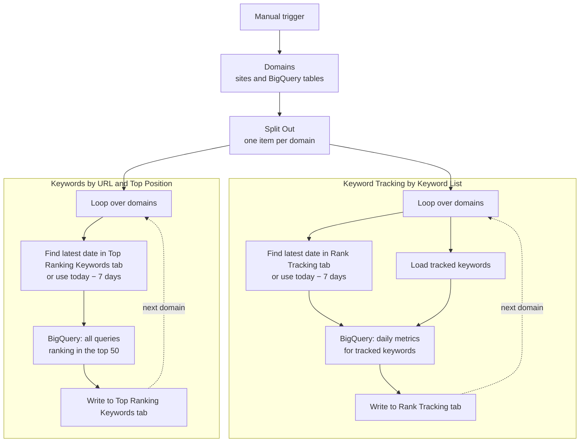

# Keyword Rank Tracker with Google Sheets

**Workflow file:** [`keyword_rank_tracker_google_sheets.json`](../keyword_rank_tracker_google_sheets.json)

This n8n workflow replaces a paid SEO rank tracker with your own Google Search Console data. It reads Search Console's bulk data export in BigQuery and writes two reports to Google Sheets for every domain you manage: daily rankings for the keywords you choose to track, and every query you already rank for in the top 50, grouped into position buckets.

---

## What it's used for

- **Tracking target keywords without a rank tracker subscription.** Get daily clicks, impressions, position, and CTR for each keyword, by URL and device, for as many keywords as you like.
- **Finding low-hanging fruit.** The Top Ranking Keywords report surfaces queries sitting in positions 11–20, which are often the fastest to push onto page one.
- **Spotting CTR problems.** Queries in the top 3 or top 10 with high impressions and low CTR usually need a better title or meta description.
- **Seeing which URL ranks for a keyword.** Rows are broken down by URL, so you can catch two pages competing for the same keyword.
- **Managing multiple sites.** One run loops through every domain in the list and writes each to its own tab.
- **Building a ranking history.** Each run adds only the days since the last run, so the sheets grow into a long-term record you own.

## At a glance

| | |
|---|---|
| **Trigger** | Manual (**Test workflow** button). Add a Schedule Trigger to run it daily. |
| **Data source** | Google Search Console bulk data export in BigQuery (`searchdata_url_impression` table) |
| **Output** | Two Google Sheets reports, with one tab per domain |
| **Metrics** | Clicks, impressions, average position, and CTR by date, keyword, URL, and device |
| **Domains** | Any number, processed one at a time |
| **Updates** | Incremental: fetches only dates newer than the latest row in each tab. The first run starts 7 days back. |
| **AI** | None |
| **Credentials** | Google BigQuery, Google Sheets |

---

## How it works



The workflow starts from one list of domains and splits into two independent loops, each shown as a labeled section on the canvas.

### Step 1: Choose the domains

| Node | What it does |
|---|---|
| `When clicking ‘Test workflow’` | Starts the workflow manually. |
| `Domains` | Holds the list of sites to process and the BigQuery table for each one. |
| `Split Out` | Turns the list into one item per domain and sends each to both loops. |

Each entry in `Domains` has three fields:

```json
{
  "domain": "example.com",
  "searchdata_url_impression": "my-project.searchconsole.searchdata_url_impression",
  "searchdata_site_impression": "my-project.searchconsole.searchdata_site_impression"
}
```

| Field | Purpose |
|---|---|
| `domain` | A label for the site. It must exactly match the **tab name** used for this site in all three spreadsheets. |
| `searchdata_url_impression` | The full BigQuery path (`project.dataset.table`) of the site's URL-level export table. Both queries read from it. |
| `searchdata_site_impression` | The site-level export table. It's included for reference but not used by the current queries. |

### Step 2: Track your keyword list

This is the **Keyword Tracking by Keyword List** section. For each domain, it pulls daily performance for only the keywords you've listed.

| Node | What it does |
|---|---|
| `Loop Over Items` | Processes one domain at a time. |
| `Google Sheets` | Reads the domain's tab in the **rank_tracking** spreadsheet. |
| `If` | Checks whether the tab already has rows. |
| `Sort` → `Get latest row` → `Get date` | If it has rows, finds the most recent `date` so only newer days are fetched. |
| `Set Date` | If the tab is empty (first run), starts from today minus 7 days. |
| `Get Tracked Keywords` | Reads the domain's tab in the **tracked_keywords** spreadsheet. |
| `Code` | Turns the keywords into a quoted, comma-separated list for SQL, e.g. `'n8n templates', 'seo automation'`. |
| `Merge Loop Data` | Combines the start date and the keyword list so the query can use both. |
| `Get Ranking Keywords by URL` | Runs the tracking query in BigQuery (described below). |
| `Insert URL Rankings` | Writes the results to the domain's tab in **rank_tracking**, then moves on to the next domain. |

**What the tracking query does**
- Reads all days after the start date.
- Keeps only queries that match your keyword list. The comparison is against the lowercase query.
- Skips anonymized queries, which Search Console hides for privacy.
- Skips URLs containing `#`, which are jump links to a section of a page, such as a table of contents entry.
- Groups the data by date, keyword, URL, and device, and calculates clicks, impressions, average position, and CTR as a percentage.

**Rows written to rank_tracking**

| Column | Meaning |
|---|---|
| `date` | The day the data is for (Pacific Time, as reported by Search Console) |
| `keyword` | The tracked keyword |
| `url` | The page that appeared in search results |
| `device` | `DESKTOP`, `MOBILE`, or `TABLET` |
| `clicks` | Clicks that day |
| `impressions` | Impressions that day |
| `position` | Average position, rounded to one decimal place |
| `ctr` | Click-through rate as a percentage, rounded to two decimal places |

### Step 3: Find the keywords you already rank for

This is the **Keywords by URL and Top Position** section. For each domain, it pulls every query you rank for in the top 50, not just the tracked ones.

| Node | What it does |
|---|---|
| `Loop Over Items1` | Processes one domain at a time. |
| `Get Top Ranking Keywords Date` | Reads the domain's tab in the **Top Ranking Keywords** spreadsheet. |
| `If1` | Checks whether the tab already has rows. |
| `Sort1` → `Get last row by date` → `Get date1` | If it has rows, finds the most recent `data_date` so only newer days are fetched. |
| `Today - 7d` | If the tab is empty (first run), starts from today minus 7 days. |
| `Get Keyword Opportunities` | Runs the opportunities query in BigQuery (described below). |
| `Insert Top Ranking Keywords` | Writes the results to the domain's tab in **Top Ranking Keywords**, then moves on to the next domain. |

**What the opportunities query does**
- Reads all days after the start date.
- Keeps rows where the page ranks in roughly the top 50 and has at least 5 impressions.
- Skips anonymized queries.
- Groups the data by date, device, query, and URL.
- Labels each row with its rich result type and a position bucket.

**Rows written to Top Ranking Keywords**

| Column | Meaning |
|---|---|
| `data_date` | The day the data is for |
| `query` | The search query |
| `url` | The page that ranked |
| `device` | `DESKTOP`, `MOBILE`, or `TABLET` |
| `result_type` | `FAQ`, `HowTo`, `Review`, or `Normal`, based on the rich result shown |
| `total_impressions` | Impressions that day |
| `total_clicks` | Clicks that day |
| `avg_position` | Average position |
| `ctr_percentage` | Click-through rate as a percentage |
| `position_bucket` | `Top 3`, `Top 10`, `Top 20`, or `Above 20` |

> **Tip:** Filter this sheet to `position_bucket = Top 20` and sort by `total_impressions` to find the pages closest to breaking onto page one.

---

## Setup

Plan on about 20 minutes, plus up to 48 hours for Search Console's first export.

### 1. Turn on Search Console bulk data export

1. In Google Cloud, create or choose a project with **billing enabled** and enable the BigQuery API.
2. In IAM, grant `search-console-data-export@system.gserviceaccount.com` the **BigQuery Job User** and **BigQuery Data Editor** roles.
3. In Search Console, open **Settings → Bulk data export** for each property and enter your Cloud project ID. The dataset name always starts with `searchconsole`.

The first export arrives within 48 hours. Search Console doesn't backfill history, so data starts from the day the export is set up. See [Google's setup guide](https://support.google.com/webmasters/answer/12917675) for details.

### 2. Create the three spreadsheets

In each spreadsheet, create one tab per domain, named exactly like the `domain` value in the `Domains` node. Add a header row to each tab:

| Spreadsheet | Header row |
|---|---|
| **rank_tracking** | `date`, `url`, `device`, `keyword`, `clicks`, `impressions`, `position`, `ctr` |
| **Top Ranking Keywords** | `data_date`, `query`, `url`, `device`, `result_type`, `total_impressions`, `total_clicks`, `avg_position`, `ctr_percentage`, `position_bucket` |
| **tracked_keywords** | `keywords` |

In **tracked_keywords**, list one keyword per row in **lowercase**, since the query compares against lowercase search queries.

### 3. Import the workflow and connect credentials

In n8n, go to **Workflows → Import from File** and select `keyword_rank_tracker_google_sheets.json`. Then connect:

| Service | Nodes |
|---|---|
| Google BigQuery | `Get Ranking Keywords by URL`, `Get Keyword Opportunities` |
| Google Sheets | `Google Sheets`, `Get Tracked Keywords`, `Insert URL Rankings`, `Get Top Ranking Keywords Date`, `Insert Top Ranking Keywords` |

### 4. Point the nodes at your own resources

The imported workflow references Width.ai's project and spreadsheets. Replace them with yours:

| What to change | Nodes |
|---|---|
| BigQuery project (`automations-451008`) | `Get Ranking Keywords by URL`, `Get Keyword Opportunities` |
| **rank_tracking** spreadsheet | `Google Sheets`, `Insert URL Rankings` |
| **tracked_keywords** spreadsheet | `Get Tracked Keywords` |
| **Top Ranking Keywords** spreadsheet | `Get Top Ranking Keywords Date`, `Insert Top Ranking Keywords` |
| Domain list and BigQuery table paths | `Domains` |

### 5. Run it

Click **Test workflow** to run it once. To keep the sheets up to date automatically, add a **Schedule Trigger** (daily works well) and connect it to the `Domains` node.

### 6. Make it yours

- **Start further back:** change `minus({ days: 7 })` in `Set Date` and `Today - 7d`. Data only exists from the date the bulk export was set up.
- **Include jump links:** delete the line `AND url NOT LIKE '%#%'` in `Get Ranking Keywords by URL`.
- **Widen or narrow the opportunities report:** in `Get Keyword Opportunities`, change the position limit (`<= 50`), the minimum impressions (`>= 5`), or the thresholds in the `position_bucket` rules.
- **Add another site:** add an entry to `Domains` and create a matching tab in all three spreadsheets.

---

## Troubleshooting

| Symptom | Likely cause |
|---|---|
| BigQuery error "Not found: Table" | The table path in `Domains` isn't the full `project.dataset.table` path, or the first export hasn't arrived yet |
| Google Sheets error that a sheet can't be found | The tab name doesn't exactly match the `domain` value |
| `Get Ranking Keywords by URL` fails on `keywordString` | The domain's tracked_keywords tab is empty, or its column isn't named `keywords` |
| SQL syntax error in `Get Ranking Keywords by URL` | A keyword contains an apostrophe, which breaks the quoted list |
| A tracked keyword never shows up | The keyword has uppercase letters, the site had no non-anonymized impressions for it, or it only ranked through a `#` URL |
| A run adds no new rows | Search Console hasn't exported newer days yet (data typically lags a couple of days), or the sheet is already up to date |
