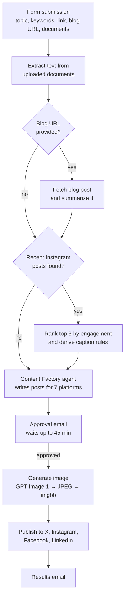

# n8n Multi-Platform Social Media Content Creation and Publishing with AI for LinkedIn, Instagram, Facebook, and X

**Workflow file:** [`n8n-social-media-content-creation.json`](../n8n-social-media-content-creation.json)

This n8n workflow turns a topic into ready-to-publish social media posts for seven platforms. It grounds the writing in your own documents and blog posts, learns from your best-performing Instagram posts, generates an image, waits for a human to approve everything by email, and then publishes to X, Instagram, Facebook, and LinkedIn.

---

## What it's used for

- **Repurposing blog content.** Paste a blog post URL and get platform-specific posts that promote it, built from a summary of the article.
- **Product launches and announcements.** Upload a product sheet or press release so the posts use accurate details instead of generic copy.
- **Keeping a consistent posting cadence.** Submit a topic and get posts for every channel in one run, instead of writing each one by hand.
- **Improving Instagram engagement over time.** Each new caption follows rules drawn from your top 3 recent posts, so what works gets repeated.
- **Agency or team workflows.** The approval step means nothing goes live until a reviewer clicks Approve.

## At a glance

| | |
|---|---|
| **Trigger** | n8n form (one-time submission per post) |
| **Posts written for** | LinkedIn, Instagram, Facebook, X, TikTok, Threads, YouTube Shorts |
| **Posts published to** | X, Instagram, Facebook, LinkedIn |
| **Optional context** | Uploaded documents, a blog post URL, past Instagram performance |
| **Human review** | Approval email with Approve / Disapprove buttons (waits up to 45 minutes) |
| **AI models** | OpenAI `gpt-5-mini` for writing, OpenAI `gpt-image-1` for images |
| **Research** | SerpAPI web search for up-to-date information on the topic |
| **Output** | Published posts plus an HTML results email showing each platform's status |

---

## How it works



The canvas is organized into four labeled steps. Step 1 has several sub-stages that each skip themselves when their input isn't available.

### Step 1: Create the written content

#### 1a. Collect input: `Submit Social Post Details`

A public n8n form collects everything the workflow needs:

| Field | Required | What it's for |
|---|---|---|
| Topic | Yes | The subject or title of the post, e.g. "New Product Launch" |
| Keywords or Hashtags (optional) | No | Keywords or hashtags the posts should include |
| Link (optional) | No | The URL included in the posts (product page, sign-up form, etc.) |
| Blog Post URL (optional) | No | A blog post to read and use as source material. This is separate from Link. |
| Context Documents (optional) | No | One or more files: `.pdf`, `.txt`, `.md`, `.csv`, `.json`, `.html` |

#### 1b. Context documents

| Node | What it does |
|---|---|
| `Split Context Documents` | Splits the uploads into one item per file. Text files are decoded here. If nothing was uploaded, it passes a placeholder so the workflow continues. |
| `Is PDF?` | Sends PDFs to extraction and everything else straight to the merge. |
| `Extract PDF Text` | Pulls the text out of each PDF. |
| `Merge Documents` | Recombines the PDF and text-file results. |
| `Build Document Context` | Joins all documents into one block with a heading per file. Caps each file at 20,000 characters and the total at 60,000. |

The Content Factory is told to treat these documents as the primary source of facts and never contradict them.

#### 1c. Blog post summary (only if a URL was provided)

| Node | What it does |
|---|---|
| `Has Blog URL?` | Skips this stage when the field is empty. |
| `Fetch Blog Post` | Downloads the page with a browser user agent, adds `https://` if missing, and times out after 30 seconds. Failures don't stop the workflow. |
| `Extract Blog Text` | Keeps the `<article>` (or `<main>`) content and removes scripts, navigation, headers, footers, sidebars, and forms. Caps the text at 30,000 characters. |
| `Summarize Blog Post` | `gpt-5-mini` writes a summary of up to 250 words: the main point, 3–6 key bullets, up to 2 reusable quotes, and the audience and takeaway. If the page couldn't be read, it says so instead. |

#### 1d. Instagram performance rules (only if posts can be fetched)

| Node | What it does |
|---|---|
| `Fetch Recent Instagram Posts` | Gets your last 25 Instagram posts with captions, likes, comments, and timestamps. |
| `Has Instagram Posts?` | Skips this stage if nothing came back (no posts, wrong ID, or missing permission). |
| `Split Out Posts` | Turns the list into one item per post. |
| `Get Post Insights` | Gets reach, saves, shares, and total interactions for each post. A failed request for one post doesn't stop the others. |
| `Rank Top 3 Posts` | Scores each post by total interactions (likes + comments + saves + shares) and keeps the top 3. Posts younger than 48 hours are excluded because Meta's insights can lag that long. Posts without insights fall back to likes + comments. |
| `Derive Caption Rules` | `gpt-5-mini` studies the top 3 and writes 5–8 concrete rules covering the hook, structure, tone, emoji use, call to action, and hashtags. |

These rules apply only to the Instagram caption, and they take priority over the general Instagram guidance in the prompt when the two conflict.

#### 1e. Write the posts: `Social Media Content Factory`

An AI agent running `gpt-5-mini` writes the posts. It receives:

- the form inputs
- the document context
- the blog post summary
- the Instagram caption rules
- a built-in brand and platform style guide (tone, length, hashtags, and call to action for each platform)

It can also call **SerpAPI** to research the latest information on the topic. A structured output parser (`Social Media Content`) forces the response into a fixed JSON shape:

```text
name, description, additional_notes
platform_posts
├─ LinkedIn        post, hashtags, call_to_action, image_suggestion
├─ Instagram       caption, hashtags, emojis, call_to_action, image_suggestion
├─ Facebook        post, hashtags, call_to_action, image_suggestion
├─ X-Twitter       post, hashtags, character_limit, image_suggestion, video_suggestion
├─ TikTok          caption, hashtags, call_to_action, video_suggestion
├─ Threads         text_post, hashtags, call_to_action, image_suggestion
└─ YouTube_Shorts  title, description, hashtags, call_to_action, video_suggestion
```

The node retries automatically if a run fails.

#### 1f. Approve the content

| Node | What it does |
|---|---|
| `Prepare Content Review Email` | `gpt-5-mini` turns the JSON into a clean HTML email with a card for each platform. |
| `Gmail User for Approval` | Sends the email with **Approve** and **Disapprove** buttons and pauses the workflow for up to 45 minutes. |
| `Is Content Approved?` | Continues only if the reviewer clicked Approve. Otherwise nothing is generated or published. |

> **Tip:** Step 1 is useful on its own. If you only want the written content, stop after the approval email and post manually.

### Step 2: Create the image

| Node | What it does |
|---|---|
| `OpenAI` | Generates a 1024×1024 image with `gpt-image-1`. The prompt is the Instagram `image_suggestion`, or the caption if the suggestion is empty. |
| `Convert Image to JPEG` | Converts the PNG output to JPEG, because Instagram's API only accepts JPEG. |
| `Save Image to imgbb.com3` | Uploads the JPEG to imgbb (no expiry) to get the public URL that Instagram requires. |

An alternative path for uploading your own image (`Image Choice` → `Rename Binary File`) is included but disabled and not connected.

### Step 3: Publish

`Set Default True 2` → `Is Approved?` is a placeholder for an optional second approval gate. It currently always passes. After it, the posts are published in parallel:

| Platform | Node(s) | What gets posted |
|---|---|---|
| X | `X Post` | The X post text (no image) |
| Instagram | `Instagram Image` → `Instragram Post` | Creates a media container from the imgbb JPEG URL with the caption, then publishes it |
| Facebook | `Facebook Post` | The generated image with the post text and call to action, on your Page |
| LinkedIn | `LinkedIn Post` | The generated image with the post, call to action, and hashtags, as your organization |

Every publishing node is set to **continue on error**, so one failed platform doesn't block the others. Each result is captured in its `… Result` node.

### Step 4: Send the results

| Node | What it does |
|---|---|
| `Merge Results` → `Aggregate` | Collects the four platform results into one item. |
| `Prepare Results Email` | `gpt-5-mini` builds an HTML table showing Success or Error and any error details for each platform. |
| `Gmail Results` | Emails the table to the reviewer. |

TikTok, Threads, and YouTube Shorts content is written and shown in the approval email but not published automatically.

---

## Setup

### 1. Import the workflow

In n8n, go to **Workflows → Import from File** and select `n8n-social-media-content-creation.json`.

### 2. Connect credentials

| Service | Nodes | Notes |
|---|---|---|
| OpenAI | `gpt`, `gpt1`, `gpt2`, `gpt3`, `gpt-4o-mini1`, `OpenAI` | `gpt-image-1` requires a [verified OpenAI organization](https://platform.openai.com/settings/organization/general) |
| SerpAPI | `SerpAPI` | [serpapi.com](https://serpapi.com/) |
| Gmail OAuth2 | `Gmail User for Approval`, `Gmail Results` | |
| Facebook Graph API | `Fetch Recent Instagram Posts`, `Get Post Insights`, `Instagram Image`, `Instragram Post`, `Facebook Post` | See the permissions below |
| X OAuth2 | `X Post` | |
| LinkedIn OAuth2 | `LinkedIn Post` | Needs permission to post as your organization |

The Meta app behind the Facebook Graph API credential needs these permissions:

- `instagram_basic`
- `instagram_content_publish`
- `instagram_manage_insights`
- `pages_read_engagement`
- `pages_manage_posts`

The Instagram account must be a Business or Creator account connected to a Facebook Page.

### 3. Replace placeholders

| Placeholder | Where | Replace with |
|---|---|---|
| `[your-unique-id]` | `Fetch Recent Instagram Posts`, `Instagram Image`, `Instragram Post` | Your **Instagram professional account ID** |
| `[your-unique-id]` | `Facebook Post` | Your **Facebook Page ID** |
| `12345678` | `LinkedIn Post` | Your **LinkedIn organization ID** |

### 4. Set environment variables

| Variable | Used by |
|---|---|
| `IMGBB_API_KEY` | `Save Image to imgbb.com3` ([get a key](https://api.imgbb.com/)) |
| `EMAIL_ADDRESS_JOE` | `Gmail User for Approval`, `Gmail Results`: the reviewer's email address |

These are read with `$env`, which requires a self-hosted n8n instance that allows environment variable access. If you can't use environment variables, replace the `$env` expressions with the values directly.

### 5. Make it yours

The Content Factory prompt is written for the **workflows.diy** brand. Before using it, update the following:

- **`Social Media Content Factory` prompt:** brand name, audience, website, general and platform hashtags, and the per-platform style guides.
- **`Rank Top 3 Posts`:** `TOP_N` (how many posts to learn from) and `MIN_AGE_HOURS` (how old a post must be to count).
- **`Build Document Context` / `Extract Blog Text`:** character limits for long documents or articles.
- **`Gmail User for Approval`:** how long to wait for approval.
- **`OpenAI`:** image quality and size.
- **`Set Default True 2`:** replace with a real second approval step if you need one.

---

## Troubleshooting

| Symptom | Likely cause |
|---|---|
| Instagram rules always say "No performance data available" | Wrong Instagram account ID in `Fetch Recent Instagram Posts`, or the credential is missing `instagram_manage_insights` |
| Blog summary says "The blog post could not be retrieved" | The page is JavaScript-rendered, blocked the request, or returned an error |
| `OpenAI` image node fails with a verification error | Your OpenAI organization isn't verified for `gpt-image-1` |
| Instagram publish fails with a media or format error | The image URL isn't a public JPEG. Check `Convert Image to JPEG` and the imgbb upload. |
| Nothing publishes after approval | The reviewer didn't click Approve within 45 minutes, or clicked Disapprove |
| One platform shows Error in the results email | Check that platform's credential, placeholder ID, and the error details in its `… Result` node |
