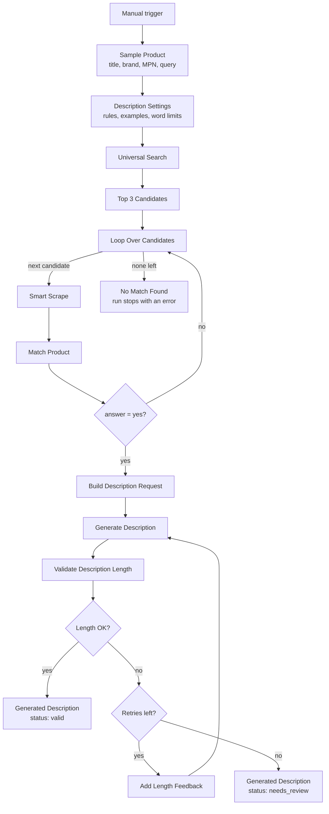

# AI Product Description Generation Workflow | Write On-Brand Ecommerce Product Descriptions with n8n and Pumice

**Workflow file:** [`pumice-ai-product-description-generation-workflow-n8n.json`](../pumice-ai-product-description-generation-workflow-n8n.json)

This n8n workflow writes product descriptions to your catalog's standards. Start with a rough title, brand, and MPN. The workflow finds the product on the web, confirms with Pumice's product matching that the page is really the same product, and generates a description from that page's data using your rules and example descriptions. Every description is word-counted. If it's too short or too long, it's regenerated with feedback about the length, and descriptions that still don't fit are flagged for review instead of slipping through.

It's the companion to the [AI Product Title Optimization Workflow](pumice-ai-product-title-optimization-workflow-n8n.md), and works the same way.

---

## What it's used for

- **Writing descriptions for new SKUs.** Turn the thin data in a supplier feed into a full product description, built from a verified product page.
- **Replacing copied manufacturer text.** Generate original descriptions instead of reusing the same copy every other retailer has.
- **Keeping a consistent voice.** The same structure, tone, and formatting rules are applied to every product.
- **Improving product page SEO.** Descriptions use the product type and search terms naturally, without keyword stuffing.
- **Keeping descriptions accurate.** Details come from a product-matched source page, and the rules forbid inventing specs or results.

## At a glance

| | |
|---|---|
| **Trigger** | Manual (**Test workflow** button). Swap `Sample Product` for a Webhook, Google Sheets, or database node when you're ready. |
| **Input** | Product `title`, `brand`, `mpn`, and a search `query` |
| **Source pages** | Top 3 results from Pumice Universal Search, checked in order |
| **Match check** | Pumice product matching (`answer: "yes"` or `"no"`) against each scraped page |
| **Description guidance** | Your rules and example descriptions, set in one node |
| **Length validation** | Minimum and maximum word counts, with up to 3 attempts by default |
| **Output** | One record with the generated description, its word count, attempts, and a `valid` or `needs_review` status |
| **Products per run** | One |
| **AI** | Pumice AI (Smart Scrape, product matching, and description generation) |
| **Credentials** | Pumice API key (HTTP Header Auth) |

---

## How it works



### Step 1: Set up the product and description settings

| Node | What it does |
|---|---|
| `When clicking 'Test workflow'` | Starts the workflow manually. |
| `Sample Product` | Holds the product to describe: `title`, `mpn`, `brand`, and the search `query`. |
| `Description Settings` | Holds everything that controls the description: word limits, number of attempts, rules, and examples. This is the node to edit. |

**Description Settings**

| Setting | Default | Purpose |
|---|---|---|
| `min_words` | `100` | Shortest acceptable description, in words |
| `max_words` | `250` | Longest acceptable description, in words |
| `max_attempts` | `3` | How many times a description is generated before it's flagged for review |
| `rules` | See below | Plain-English instructions sent with every request |
| `examples` | 1 example description | Example descriptions, as plain strings, that show the style you want |

The default rules are:

- Open with one sentence that names the product, including the brand, and says what it does for the customer
- Follow with the key benefits, then how and when to use it, using only information from the source data
- Write two or three short plain-text paragraphs. Do not use headings, bullet points, or HTML
- Write to the customer using you and your
- Use the product type and the words shoppers search for naturally. Do not stuff keywords or list them at the end
- Include size, coverage, and other specifications when they appear in the source data
- Do not include the MPN or SKU
- Do not use promotional words such as best, sale, new, free shipping, or guaranteed
- Do not use all caps, emojis, or symbols such as ! * $ ® ™
- Only include attributes and claims that appear in the source data. Do not invent specifications or results

Two more rules are added automatically for each product: the word range from `min_words` and `max_words`, and the product's brand.

Each example is a description written as a plain string. It can be a finished description or a pattern with placeholders. The default is a 141-word, three-paragraph pattern for the same lawn product as the title workflow's example:

> {brand} Tall Fescue Grass Sun or Shade Fertilizer/Seed/Soil Improver gives you a thicker, greener lawn in full sun or partial shade. Each bag combines tall fescue grass seed with a starter fertilizer and a soil improver, so you can seed, feed, and condition your soil in one application.
>
> Tall fescue grows deep roots that help it handle heat, dry spells, and heavy foot traffic, which makes it a good fit for busy family lawns. The soil improver helps the seed hold moisture while it germinates, and the fertilizer supports quick, even growth. Each {size} bag covers up to {coverage} sq. ft.
>
> Use it to start a new lawn, overseed thin areas, or repair bare patches. Spread it evenly with a broadcast or drop spreader, rake it lightly into the soil, and keep the area moist until the new grass is established.

This shows the structure to follow: what the product is and does, then its benefits and specifications, then how to use it.

### Step 2: Find and verify the source page

This works the same as in the [Product Data Enrichment Workflow](pumice-product-data-enrichment-workflow-n8n.md).

| Node | What it does |
|---|---|
| `Universal Search` | Searches for the product with Pumice Universal Search (`/api/scraper/universal`). |
| `Top 3 Candidates` | Takes the first three result URLs and outputs one item per URL. |
| `Loop Over Candidates` | Checks the candidates one at a time, in search-result order. |
| `Smart Scrape` | Scrapes the candidate page (`/api/scraper/smart-scrape`) for its title, description, specifications, SKU or MPN, brand, and image URLs. |
| `Match Product` | Compares your input product with the scraped page using Pumice product matching (`/v1/merchandising-api/product_matching`). |
| `Is Match?` | Uses the first candidate that returns `{"answer": "yes"}`. Otherwise it moves to the next candidate. |
| `No Match Found` | Stops the run with an error if none of the three candidates match. |

If a scrape or match request fails, that candidate is treated as a non-match and the loop moves on.

### Step 3: Generate and validate the description

| Node | What it does |
|---|---|
| `Build Description Request` | Builds the request from the matched page's scrape, plus your rules and examples. The scraped title goes in `title`, everything else scraped from the page (description, specifications, brand, MPN) goes in `description`, and the first image goes in `image_url`. |
| `Generate Description` | Calls Pumice's `/api/generate_description`. |
| `Validate Description Length` | Counts the description's words (ignoring any HTML tags) and checks the count against `min_words` and `max_words`. |
| `Length OK?` | Sends valid descriptions to `Generated Description`. |
| `Retries Left?` | If the description failed and attempts remain, sends it to `Add Length Feedback`. Otherwise it goes to `Generated Description` flagged for review. |
| `Add Length Feedback` | Resends the original request with one more rule, for example: *The previous description was 312 words, which is too long. Rewrite it to be between 100 and 250 words.* |
| `Generated Description` | Builds the final record. |

The request sent to `Generate Description` looks like this:

```json
{
  "product": {
    "title": "Scraped product title",
    "description": "Scraped description\nspecifications: {...}\nmpn: ...\nbrand: ...",
    "image_url": "https://..."
  },
  "customer_rules": ["Open with one sentence that names the product...", "..."],
  "examples": ["{brand} Tall Fescue Grass Sun or Shade Fertilizer/Seed/Soil Improver gives you..."]
}
```

**The output record**

| Field | Meaning |
|---|---|
| `mpn` | The MPN from your input |
| `brand` | The brand from your input |
| `source_url` | The matched page the description was built from |
| `original_title` | Your input title |
| `scraped_title` | The title found on the matched page |
| `image_url` | The first image found on the matched page |
| `generated_description` | The new description |
| `word_count` | Its length in words |
| `attempts` | How many generations it took |
| `status` | `valid` if it passed the length check, `needs_review` if it never did |
| `issue` | Empty when valid, otherwise `too_long`, `too_short`, or `empty` |

---

## Setup

Plan on about 15 minutes, most of it writing your rules and examples.

### 1. Get a Pumice API key

Sign in to [Pumice](https://app.pumice.ai) and copy your API key.

### 2. Import the workflow and add the credential

1. In n8n, go to **Workflows → Import from File** and select `pumice-ai-product-description-generation-workflow-n8n.json`.
2. Create an **HTTP Header Auth** credential named `Pumice API`:
   - **Name:** `x-api-key`
   - **Value:** your Pumice API key
3. Select that credential in each Pumice node:

| Service | Nodes |
|---|---|
| Pumice API (HTTP Header Auth) | `Universal Search`, `Smart Scrape`, `Match Product`, `Generate Description` |

If you already imported the title optimization workflow, reuse the same `Pumice API` credential.

### 3. Write your rules and examples

Open `Description Settings` and replace the defaults with your own standards:

- **Length:** set `min_words` and `max_words` for where the description will appear. Around 100–250 words suits most product pages. Marketplaces and feeds often want less, and detailed technical products may need more.
- **Rules:** write one instruction per line. Specific rules work better than general ones, for example "Mention coverage in the second paragraph" rather than "Be informative."
- **Examples:** replace the default with descriptions from your own catalog, one string each. Use real descriptions you're happy with, or patterns with placeholders like `{brand}` and `{size}`. Keep examples within your word limits, or the model will learn the wrong length.

If your examples use a different format, such as bullet points or HTML, update the rule about plain-text paragraphs to match.

### 4. Run it with the sample product

Click **Test workflow**. Open `Generated Description` to see the result, and `Validate Description Length` to see each attempt. The sample product is the placeholder "Acme Widget", so swap in a real product from your catalog for a realistic test.

### 5. Connect your own product data

Replace `Sample Product` with your real source, such as a Webhook, Google Sheets, or a database query. It needs to output these fields:

```json
{
  "title": "Widget",
  "mpn": "WB-100",
  "brand": "Acme",
  "query": "Acme Widget WB-100 specifications"
}
```

If you rename or replace the node, update the references to `Sample Product` in `Top 3 Candidates` and `No Match Found`.

The workflow generates **one description per run**. To process a list, call it once per product, for example from another workflow with **Execute Workflow** inside a loop.

### 6. Save the results

The workflow ends at `Generated Description`. Add a node after it to write the result to Google Sheets, Airtable, your PIM, or your store. Filter on `status = needs_review` to send descriptions that failed validation to a person.

### 7. Make it yours

- **Allow more or fewer attempts:** change `max_attempts` in `Description Settings`.
- **Check more or fewer pages:** change `.slice(0, 3)` in `Top 3 Candidates`.
- **Add more checks:** extend `Validate Description Length`, for example to reject descriptions that contain banned words or don't mention the brand. Set `issue` to a short code and update the feedback text in `Add Length Feedback` to match.
- **Keep going when nothing matches:** replace `No Match Found` with a node that logs the product for manual review, so batch runs don't stop.

---

## Troubleshooting

| Symptom | Likely cause |
|---|---|
| `401` or `403` from a Pumice node | The `Pumice API` credential is missing, or the header name isn't exactly `x-api-key` |
| `Loop Over Candidates` receives no items | Universal Search returned no results. Try a more specific query with the brand and MPN. |
| The run stops at `No Match Found` | None of the top 3 pages were the same product. Improve the query or check the input MPN. |
| Every candidate is a non-match, even obvious ones | Check `Match Product`'s output. An error there (for example a `404`) also counts as a non-match, so confirm the endpoint URL and credential. |
| `Generate Description` returns an error about `examples` | An example isn't a plain string. Each entry in `examples` must be a quoted description, not an object. |
| Descriptions often come back `needs_review` | The word range is too narrow for your products, or your example descriptions are outside the range. Widen the limits or fix the examples. |
| Descriptions are short or vague | The matched page had little content. Check `Smart Scrape`'s output, and consider lowering `min_words` for products with little source data. |
| Descriptions include claims that aren't on the product | Check `Smart Scrape`'s output, and keep the rule against inventing specifications or results. |
