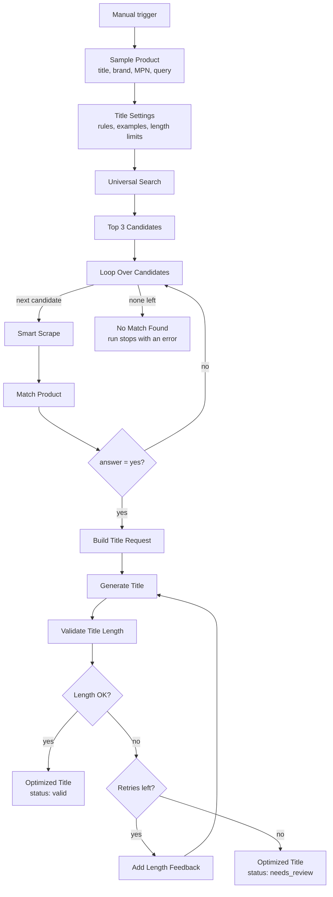

# AI Product Title Optimization Workflow | Generate On-Brand Ecommerce Titles with n8n and Pumice

**Workflow file:** [`pumice-ai-product-title-optimization-workflow-n8n.json`](../pumice-ai-product-title-optimization-workflow-n8n.json)

This n8n workflow rewrites product titles to your catalog's standards. Start with a rough title, brand, and MPN. The workflow finds the product on the web, confirms with Pumice's product matching that the page is really the same product, and generates a new title using your rules and example titles. Every title is length-checked. If it's too short or too long, it's regenerated with feedback about the length, and titles that still don't fit are flagged for review instead of slipping through.

---

## What it's used for

- **Cleaning up supplier titles.** Turn titles like `TF grass seed sun/shade` into consistent, searchable titles such as `Greenfield Tall Fescue Grass Sun or Shade Fertilizer/Seed/Soil Improver Lawn Repair`.
- **Enforcing a title format across the catalog.** The same brand-first structure, casing, and separators are applied to every product.
- **Meeting marketplace and channel limits.** Set a minimum and maximum length so titles fit Amazon, Google Shopping, or your own site's layout.
- **Improving search and ad performance.** Titles include the product type and key attributes shoppers search for, without promotional filler.
- **Keeping titles accurate.** Attributes come from a product-matched source page, and the rules forbid inventing specs.

## At a glance

| | |
|---|---|
| **Trigger** | Manual (**Test workflow** button). Swap `Sample Product` for a Webhook, Google Sheets, or database node when you're ready. |
| **Input** | Product `title`, `brand`, `mpn`, and a search `query` |
| **Source pages** | Top 3 results from Pumice Universal Search, checked in order |
| **Match check** | Pumice product matching (`answer: "yes"` or `"no"`) against each scraped page |
| **Title guidance** | Your rules and example titles, set in one node |
| **Length validation** | Minimum and maximum character counts, with up to 3 attempts by default |
| **Output** | One record with the original and optimized title, its length, attempts, and a `valid` or `needs_review` status |
| **Products per run** | One |
| **AI** | Pumice AI (Smart Scrape, product matching, and title generation) |
| **Credentials** | Pumice API key (HTTP Header Auth) |

---

## How it works



### Step 1: Set up the product and title settings

| Node | What it does |
|---|---|
| `When clicking 'Test workflow'` | Starts the workflow manually. |
| `Sample Product` | Holds the product to optimize: `title`, `mpn`, `brand`, and the search `query`. |
| `Title Settings` | Holds everything that controls the title: length limits, number of attempts, rules, and examples. This is the node to edit. |

**Title Settings**

| Setting | Default | Purpose |
|---|---|---|
| `min_length` | `50` | Shortest acceptable title, in characters including spaces |
| `max_length` | `120` | Longest acceptable title, in characters including spaces |
| `max_attempts` | `3` | How many times a title is generated before it's flagged for review |
| `rules` | See below | Plain-English instructions sent with every request |
| `examples` | 1 title pattern | Example titles, as plain strings, that show the style you want |

The default rules are:

- Start the title with the brand name
- Follow this order: brand, product line or variety, growing conditions or use, product type, then search keywords
- Use title case
- Separate related product types with a slash and no spaces, for example Fertilizer/Seed/Soil Improver
- Do not use commas or hyphens as separators
- End the title with keywords shoppers search for, without repeating words already in the title
- Do not include the MPN or SKU
- Do not use promotional words such as best, sale, new, free shipping, or guaranteed
- Do not use all caps, emojis, or symbols such as ! * $ ® ™
- Only include attributes that appear in the source data. Do not invent specifications

Two more rules are added automatically for each product: the length range from `min_length` and `max_length`, and the product's brand.

Each example is a title written as a plain string. It can be a finished title or a pattern with placeholders, like the default:

```json
[
  "{brand} Tall Fescue Grass Sun or Shade Fertilizer/Seed/Soil Improver {keywords}"
]
```

This shows the structure to follow: the brand first, then the grass type, growing conditions, and product type, with keywords at the end.

### Step 2: Find and verify the source page

This works the same as in the [Product Data Enrichment Workflow](pumice-product-data-enrichment-workflow-n8n.md).

| Node | What it does |
|---|---|
| `Universal Search` | Searches for the product with Pumice Universal Search (`/api/scraper/universal`). |
| `Top 3 Candidates` | Takes the first three result URLs and outputs one item per URL. |
| `Loop Over Candidates` | Checks the candidates one at a time, in search-result order. |
| `Smart Scrape` | Scrapes the candidate page (`/api/scraper/smart-scrape`) for its title, description, specifications, SKU or MPN, brand, and image URLs. |
| `Match Product` | Compares your input product with the scraped page using Pumice product matching (`/v1/merchandising-api/product_matching`). |
| `Is Match?` | Uses the first candidate that returns `{"answer": "yes"}`. Otherwise it moves to the next candidate. |
| `No Match Found` | Stops the run with an error if none of the three candidates match. |

If a scrape or match request fails, that candidate is treated as a non-match and the loop moves on.

### Step 3: Generate and validate the title

| Node | What it does |
|---|---|
| `Build Title Request` | Builds the request from the matched page's scrape, plus your rules and examples. The scraped title goes in `title`, everything else scraped from the page (description, specifications, brand, MPN) goes in `description`, and the first image goes in `image_url`. |
| `Generate Title` | Calls Pumice's `/api/generate_title`. |
| `Validate Title Length` | Counts the title's characters and checks it against `min_length` and `max_length`. |
| `Length OK?` | Sends valid titles to `Optimized Title`. |
| `Retries Left?` | If the title failed and attempts remain, sends it to `Add Length Feedback`. Otherwise it goes to `Optimized Title` flagged for review. |
| `Add Length Feedback` | Resends the original request with one more rule, for example: *The previous title "…" was 134 characters, which is too long. Rewrite it to be between 50 and 120 characters, including spaces.* |
| `Optimized Title` | Builds the final record. |

**The output record**

| Field | Meaning |
|---|---|
| `mpn` | The MPN from your input |
| `brand` | The brand from your input |
| `source_url` | The matched page the title was built from |
| `original_title` | Your input title |
| `scraped_title` | The title found on the matched page |
| `optimized_title` | The new title |
| `title_length` | Its length in characters |
| `attempts` | How many generations it took |
| `status` | `valid` if it passed the length check, `needs_review` if it never did |
| `issue` | Empty when valid, otherwise `too_long`, `too_short`, or `empty` |

---

## Setup

Plan on about 15 minutes, most of it writing your rules and examples.

### 1. Get a Pumice API key

Sign in to [Pumice](https://app.pumice.ai) and copy your API key.

### 2. Import the workflow and add the credential

1. In n8n, go to **Workflows → Import from File** and select `pumice-ai-product-title-optimization-workflow-n8n.json`.
2. Create an **HTTP Header Auth** credential named `Pumice API`:
   - **Name:** `x-api-key`
   - **Value:** your Pumice API key
3. Select that credential in each Pumice node:

| Service | Nodes |
|---|---|
| Pumice API (HTTP Header Auth) | `Universal Search`, `Smart Scrape`, `Match Product`, `Generate Title` |

### 3. Write your rules and examples

Open `Title Settings` and replace the defaults with your own standards:

- **Length:** set `min_length` and `max_length` for the channel the titles are for. For example, Google Shopping shows about 70 characters and allows 150, and many storefronts truncate titles at around 60–80 characters.
- **Rules:** write one instruction per line. Specific rules work better than general ones, for example "Put the size before the color" rather than "Make it clear."
- **Examples:** replace the default with titles from your own catalog, one string each. Use real titles you're happy with, or patterns with placeholders like `{brand}` and `{keywords}`. Keep examples within your length limits, or the model will learn the wrong length.

### 4. Run it with the sample product

Click **Test workflow**. Open `Optimized Title` to see the result, and `Validate Title Length` to see each attempt.

### 5. Connect your own product data

Replace `Sample Product` with your real source, such as a Webhook, Google Sheets, or a database query. It needs to output these fields:

```json
{
  "title": "Widget",
  "mpn": "WB-100",
  "brand": "Acme",
  "query": "Acme Widget WB-100 specifications"
}
```

If you rename or replace the node, update the references to `Sample Product` in `Top 3 Candidates` and `No Match Found`.

The workflow optimizes **one product per run**. To process a list, call it once per product, for example from another workflow with **Execute Workflow** inside a loop.

### 6. Save the results

The workflow ends at `Optimized Title`. Add a node after it to write the result to Google Sheets, Airtable, your PIM, or your store. Filter on `status = needs_review` to send titles that failed validation to a person.

### 7. Make it yours

- **Allow more or fewer attempts:** change `max_attempts` in `Title Settings`.
- **Check more or fewer pages:** change `.slice(0, 3)` in `Top 3 Candidates`.
- **Add more checks:** extend `Validate Title Length`, for example to reject titles that don't start with the brand or that contain banned words. Set `issue` to a short code and update the feedback text in `Add Length Feedback` to match.
- **Keep going when nothing matches:** replace `No Match Found` with a node that logs the product for manual review, so batch runs don't stop.

---

## Troubleshooting

| Symptom | Likely cause |
|---|---|
| `401` or `403` from a Pumice node | The `Pumice API` credential is missing, or the header name isn't exactly `x-api-key` |
| `Loop Over Candidates` receives no items | Universal Search returned no results. Try a more specific query with the brand and MPN. |
| The run stops at `No Match Found` | None of the top 3 pages were the same product. Improve the query or check the input MPN. |
| Every candidate is a non-match, even obvious ones | Check `Match Product`'s output. An error there (for example a `404`) also counts as a non-match, so confirm the endpoint URL and credential. |
| `Generate Title` returns an error about `examples` | An example isn't a plain string. Each entry in `examples` must be a quoted title, not an object. |
| Titles often come back `needs_review` | The length range is too narrow for your products, or your example titles are outside the range. Widen the limits or fix the examples. |
| Titles include attributes that aren't on the product | The matched page's scrape had little content. Check `Smart Scrape`'s output, and keep the "do not invent specifications" rule. |
