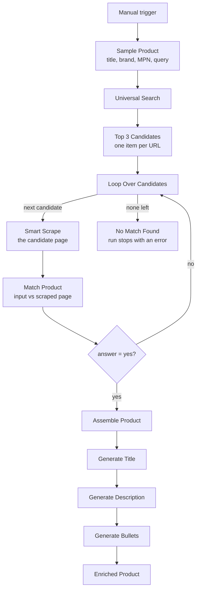

# Product Data Enrichment Workflow | Automate PDP Creation with n8n and Pumice AI

**Workflow file:** [`pumice-product-data-enrichment-workflow-n8n.json`](../pumice-product-data-enrichment-workflow-n8n.json)

This n8n workflow turns a bare product record (a title, brand, and MPN) into ready-to-use product detail page (PDP) content. It searches the web for the product, scrapes the top results, confirms with Pumice's product matching that a page is really the same product, and then uses that page's data to generate a new title, description, and bullet points that follow your content rules.

---

## What it's used for

- **Creating PDPs for new SKUs.** Start from the minimal data a supplier feed or ERP gives you and get a full title, description, and bullets back.
- **Filling gaps in a thin catalog.** Enrich products that have a title and MPN but no description or feature bullets.
- **Avoiding content from the wrong product.** Every source page is checked with product matching before it's used, so a similar model or a different variant doesn't end up on your PDP.
- **Keeping copy on-brand.** Title length, tone, and "don't invent specs" rules are applied to every generated field.
- **Finding a product image.** The first image URL from the matched page is returned alongside the copy.

## At a glance

| | |
|---|---|
| **Trigger** | Manual (**Test workflow** button). Swap `Sample Product` for a Webhook, Google Sheets, or database node when you're ready. |
| **Input** | Product `title`, `brand`, `mpn`, and a search `query` |
| **Source pages** | Top 3 results from Pumice Universal Search, checked in order |
| **Match check** | Pumice product matching (`answer: "yes"` or `"no"`) against each scraped page |
| **Generated content** | Product title, description, and bullet points |
| **Output** | One enriched record with the original data, source URL, image URL, and generated fields |
| **Products per run** | One |
| **AI** | Pumice AI (Smart Scrape, product matching, and content generation) |
| **Credentials** | Pumice API key (HTTP Header Auth) |

---

## How it works



### Step 1: Find candidate pages

| Node | What it does |
|---|---|
| `When clicking 'Test workflow'` | Starts the workflow manually. |
| `Sample Product` | Holds the product to enrich: `title`, `mpn`, `brand`, and the search `query`. |
| `Universal Search` | Sends the query to Pumice's Universal Search (`/api/scraper/universal`). |
| `Top 3 Candidates` | Takes the URLs of the first three search results and outputs one item per URL, numbered with `candidate_rank`. |

The query does most of the work in finding the right pages. Including the brand, product name, and MPN (for example `Acme Widget WB-100 specifications`) gives the best results.

### Step 2: Scrape and match each candidate

The candidates are checked one at a time, in search-result order. The loop stops at the first page that matches, so later candidates aren't scraped.

| Node | What it does |
|---|---|
| `Loop Over Candidates` | Sends one candidate URL at a time into the loop. |
| `Smart Scrape` | Scrapes the candidate page with Pumice Smart Scrape (`/api/scraper/smart-scrape`), extracting the title, description, specifications, SKU or MPN, brand, and image URLs. |
| `Match Product` | Sends your input product and the scraped page to Pumice product matching (`/v1/merchandising-api/product_matching`). |
| `Is Match?` | If the response is `{"answer": "yes"}`, the candidate goes on to Step 3. Anything else sends the loop to the next candidate. |
| `No Match Found` | If none of the three candidates match, stops the run with an error naming the product. |

**What's compared in `Match Product`**

| Field | Contents |
|---|---|
| `product_1` | Your input product: `title`, `brand`, and `mpn` from `Sample Product` |
| `product_2` | The scraped page: `title`, `description`, `mpn` (or SKU), and `brand` from `Smart Scrape` |

Both are sent as JSON strings, as the product matching endpoint expects. `customer_rules`, `fields`, and `examples` are sent empty.

If a scrape or match request fails (for example, the page blocks scraping or times out), that candidate is treated as a non-match and the loop moves on instead of failing the whole run.

### Step 3: Generate the PDP content

| Node | What it does |
|---|---|
| `Assemble Product` | Builds the request used by all three generation calls from the matched page's scrape: the product (`title`, `description`, `image_url`) and your `customer_rules`. |
| `Generate Title` | Calls `/api/generate_title`. |
| `Generate Description` | Calls `/api/generate_description`. |
| `Generate Bullets` | Calls `/api/generate_bullet`. |
| `Enriched Product` | Combines the original data and the three generated fields into one record. |

`Assemble Product` uses the scraped title if there is one, and falls back to your input title if not. It uses the first image URL found on the page.

The default content rules are:

- Keep the title under 80 characters
- Use a friendly, professional tone
- Do not invent specifications that are not present in the source data

**The enriched record**

| Field | Meaning |
|---|---|
| `mpn` | The MPN from your input |
| `brand` | The brand from your input |
| `source_url` | The matched page the content was built from |
| `original_title` | The title used for generation (scraped, or your input title as a fallback) |
| `image_url` | The first image found on the matched page |
| `generated_title` | The new product title |
| `generated_description` | The new product description |
| `generated_bullets` | The new feature bullets |

---

## Setup

Plan on about 10 minutes.

### 1. Get a Pumice API key

Sign in to [Pumice](https://app.pumice.ai) and copy your API key.

### 2. Import the workflow and add the credential

1. In n8n, go to **Workflows → Import from File** and select `pumice-product-data-enrichment-workflow-n8n.json`.
2. Create an **HTTP Header Auth** credential named `Pumice API`:
   - **Name:** `x-api-key`
   - **Value:** your Pumice API key
3. Select that credential in each Pumice node:

| Service | Nodes |
|---|---|
| Pumice API (HTTP Header Auth) | `Universal Search`, `Smart Scrape`, `Match Product`, `Generate Title`, `Generate Description`, `Generate Bullets` |

### 3. Run it with the sample product

Click **Test workflow**. Open `Enriched Product` to see the result, and `Top 3 Candidates` and `Is Match?` to see which pages were checked and which one was used.

### 4. Connect your own product data

Replace `Sample Product` with your real source, such as a Webhook, Google Sheets, or a database query. It needs to output these fields:

```json
{
  "title": "Widget",
  "mpn": "WB-100",
  "brand": "Acme",
  "query": "Acme Widget WB-100 specifications"
}
```

If you rename or replace the node, update the references to `Sample Product` in `Top 3 Candidates` and `No Match Found`.

The workflow enriches **one product per run**. To process a list, run it once per product, for example by calling it from another workflow with **Execute Workflow** inside a loop, or wrap it in a **Loop Over Items** node.

### 5. Save the results

The workflow ends at `Enriched Product`. Add a node after it to write the record where you need it, such as Google Sheets, Airtable, your PIM, or Shopify.

### 6. Make it yours

- **Change the content rules:** edit the `customer_rules` list in `Assemble Product`. Each rule is a plain-English instruction applied to the title, description, and bullets.
- **Check more or fewer pages:** change `.slice(0, 3)` in `Top 3 Candidates`.
- **Change what's scraped:** edit the `prompt` in `Smart Scrape`, for example to also pull dimensions, materials, or compatibility.
- **Add matching rules:** fill in `customer_rules` in `Match Product`, for example to treat different colors of the same model as a match.
- **Keep going when nothing matches:** replace `No Match Found` with a node that logs the product for manual review, so a batch run doesn't stop.

---

## Troubleshooting

| Symptom | Likely cause |
|---|---|
| `401` or `403` from a Pumice node | The `Pumice API` credential is missing, or the header name isn't exactly `x-api-key` |
| `Loop Over Candidates` receives no items | Universal Search returned no results. Try a more specific query with the brand and MPN. |
| The run stops at `No Match Found` | None of the top 3 pages were the same product. Improve the query, check more candidates, or check the input MPN. |
| Every candidate is a non-match, even obvious ones | Check `Match Product`'s output. An error there (for example a `404`) also counts as a non-match, so confirm the endpoint URL and credential. |
| Generated copy is thin or generic | The matched page had little content. Check `Smart Scrape`'s output for that candidate. |
| `image_url` is empty | The matched page's scrape didn't include any image URLs |
